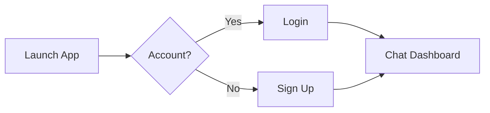

# ChatApp - Real-Time AI-Powered Chat App

**ChatApp** is a modern, feature-rich chat application built using **Flutter** and **Dart**, with **Firebase** as the backend. It offers real-time messaging, AI-powered features like image-to-text and speech-to-text generation, and seamless chat management functionalities. Whether you're looking to chat with friends or leverage AI capabilities, ChatApp has you covered!

## Features

- **User Authentication**: Secure login and registration using Firebase Authentication (email/password, anonymous, or other supported methods).
- **Real-Time Messaging**: Instant messaging powered by Firebase Firestore for a smooth and responsive chat experience.
- **Image-to-Text Generation**: Upload an image, and the AI extracts text from it (powered by an AI integration).
- **Speech-to-Text Generation**: Convert spoken words into text using AI-driven speech recognition.
- **Share Chat as PDF**: Export your chat conversations as PDF files for easy sharing.
- **Chat History**: View your past conversations with an intuitive chat history interface.
- **Stop Generating**: Halt AI text generation mid-process if needed.
- **Copy AI-Generated Answers**: Easily copy AI-generated text to your clipboard for quick use.

## Screenshots

  
  
  
  

  
  
  
  

  
  
  
  

## Prerequisites

Before you begin, ensure you have the following installed:  
- [Flutter SDK](https://flutter.dev/docs/get-started/install) (v3.x.x or later)  
- [Dart](https://dart.dev/get-dart) (included with Flutter)  
- [Firebase Account](https://firebase.google.com/)  
- An IDE like [Android Studio](https://developer.android.com/studio) or [VS Code](https://code.visualstudio.com/)  
- (Optional) Emulator or physical device for testing  

## Dependencies
Key packages used in this project:

- **firebase_core**: Firebase initialization
- **firebase_auth**: User authentication
- **cloud_firestore**: Real-time database
- **firebase_storage**: (Optional) For image uploads
- **speech_to_text**: Speech-to-text functionality
- **pdf**: PDF generation for chat export

*(Add any other AI or UI packages you used)*  
Full list available in `pubspec.yaml`.

## 🚀 Usage

### 1. Authentication

### Usage
- **Sign Up/Login**: Create an account or log in using your credentials.
- **Start Chatting**: Send real-time messages to other users.
- **AI Features**:
  - Upload an image to extract text.
  - Use the mic to convert speech to text.
- **Manage Chats**:
  - View chat history.
  - Export chats as PDF.
  - Copy or stop AI-generated responses as needed.

